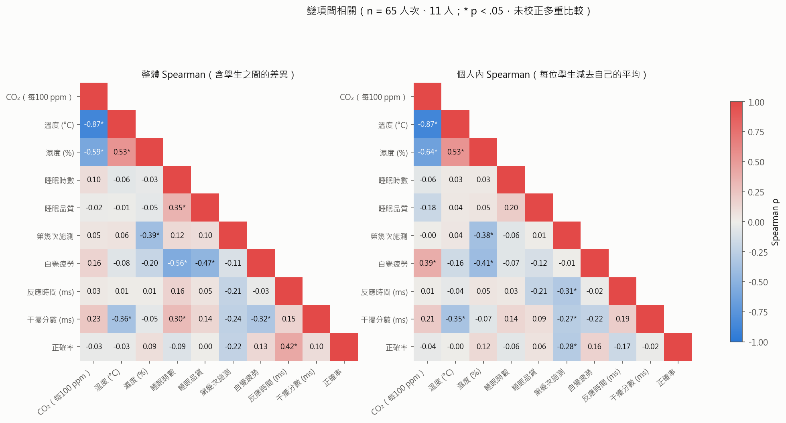
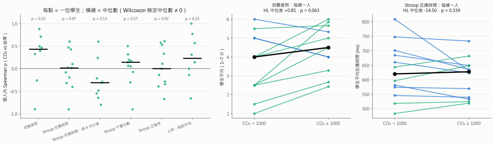
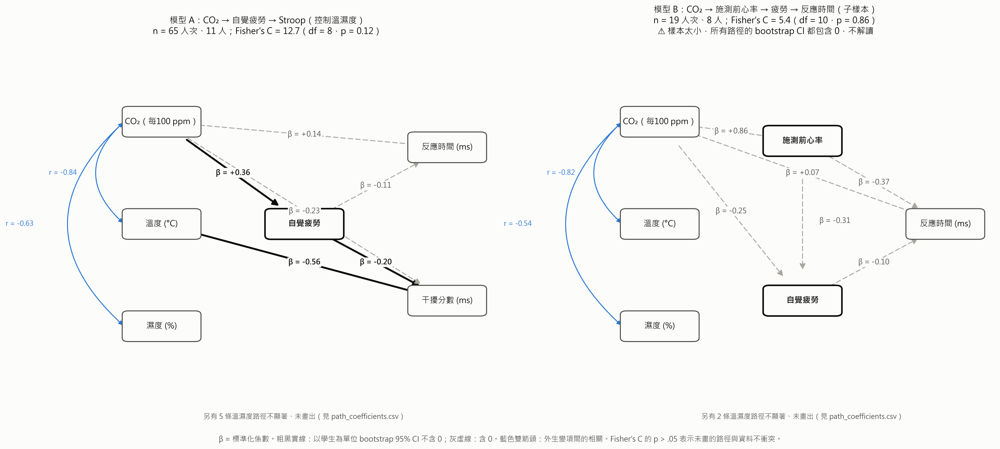
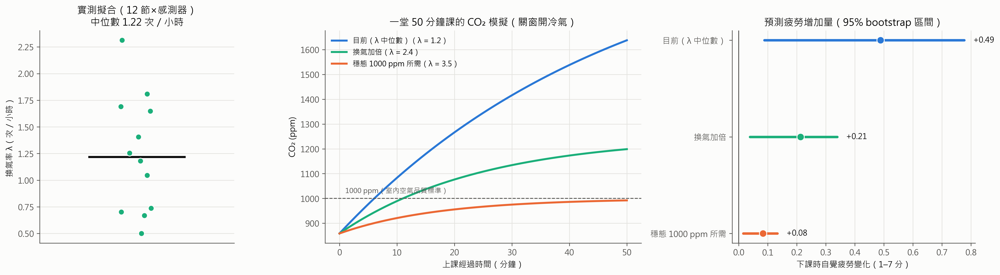

# 研究結果報告：教室 CO₂ 與學生認知、疲勞、生理（2026-09-17 ～ 10-02）

重現方式：`python src/run_analysis.py`（約 20 分鐘，會依序跑完 LMM、無母數、徑路分析、相關矩陣與模擬預測）。
所有圖表在 `results/figures/`，各有 PNG 與 SVG（`results/figures/svg/`；SVG 的文字可直接編輯）。
數值總表：[FACTS.md](FACTS.md)。

---

## 0. 結論摘要

| 研究問題 | 參數法（LMM） | 無母數（以學生為單位） | 徑路分析 | 綜合判斷 |
|---|---|---|---|---|
| CO₂ → 自覺疲勞 | +0.063 分／100 ppm，p = 0.009 | 方向一致，但 p = 0.05–0.25 | +0.10 分／100 ppm，bootstrap CI 不含 0 | **有一致的正向訊號，證據強度中等** |
| CO₂ → Stroop 反應時間 | ≈ 0（CI ±2 ms／100 ppm） | ≈ 0 | ≈ 0 | **沒有效應**（把握度高） |
| CO₂ → 干擾分數、正確率 | 不顯著 | 不顯著 | 間接路徑方向與理論相反 | 沒有可靠效應 |
| CO₂ → 心率／HRV | 結果互相矛盾 | 不顯著 | 子樣本太小，無法估計 | **目前無法回答** |
| CO₂ → 疲勞 → 認知（中介） | — | — | CO₂ → 疲勞成立；疲勞 → 反應時間不成立 | **中介路徑不成立** |

一句話：**在這間教室，CO₂ 升高時，學生自己覺得比較累，但 Stroop 測不到認知表現變差。** 由於 CO₂ 與溫度、濕度、冷氣高度連動，疲勞的效應目前無法完全歸因於 CO₂ 本身（第 4、6 節）。

---

## 1. 變項類別

| 角色 | 變項 | 尺度／型態 | 來源與處理 | 用在哪裡 |
|---|---|---|---|---|
| **主要自變項（外生）** | CO₂ 濃度 | 連續、比率尺度（ppm）；模型中以每 100 ppm 為單位 | SCD30 × 2（Wa1、Wa2），30 秒一筆；主分析用兩臺平均。Stroop 取測驗前後各 60 秒、疲勞取填寫前 3 分鐘、心率取 5 分鐘窗 | 全部 |
| **共變項（外生，環境）** | 溫度 | 連續、等距（°C） | 同一臺 SCD30、同一時間窗 | LMM 敏感度分析、徑路分析 |
| | 相對濕度 | 連續（%） | 同上 | 同上 |
| | 冷氣註記 | 名目（冷氣／後半冷氣／無註記） | 研究代碼對照表 | 描述；與 CO₂ 共線，未單獨建模 |
| | 上午／下午 | 二元 | 由時間判定 | 敏感度分析 |
| **共變項（外生，個人）** | 睡眠時數 | 順序（3 級，編碼 5／7／8.5 小時） | 疲勞量表試前題 | 疲勞模型、徑路分析 |
| | 睡眠品質 | 順序（1–7 Likert，視為準連續） | 同上 | 同上 |
| **設計／時間變項** | 第幾次施測 | 計數（1–14） | 依時間排序 | 所有 Stroop 模型（控制練習效應） |
| | 第幾次填寫 | 計數 | 同上 | 疲勞模型 |
| | 上課經過分鐘 | 連續 | 每節第一個 5 分鐘窗為 0 | 心率／HRV 模型 |
| | 裝置種類 | 名目（心電貼片／手環） | 裝置代號 | 心率模型 |
| **中介變項** | 自覺疲勞（現在） | 順序（1–7，單題，視為準連續） | Google 表單 | 結果與中介 |
| | 施測前 10 分鐘心率 | 連續（bpm） | 手環＋品質 good 的貼片，依研究代碼對照表連到學生 | 徑路模型 B |
| | HRV：log(RMSSD) | 連續（取對數） | 僅貼片，5 分鐘窗，異常拍 < 20% | 心率／HRV 模型 |
| **結果變項** | Stroop 平均反應時間 | 連續、比率（ms） | 答對且 200–3000 ms 的題目平均 | 全部 |
| | Stroop 干擾分數 | 連續（ms），差異分數 | 不一致題 − 中性題（各 8 題） | 全部 |
| | Stroop 正確率 | 比例（0–1），有天花板效應 | 24 題 | LMM、無母數 |
| | FSS（過去 24 小時） | 9 題 Likert 平均 | 同一份量表 | **負對照**（理論上不該隨當下 CO₂ 變動） |
| **分組（隨機效應）** | 學生 | 名目（12 人，假名 S01–S12） | — | 隨機截距、無母數的分析單位、bootstrap 重抽單位 |
| | 裝置 × 節次 | 名目 | 無法對應到學生的心率資料 | 心率隨機截距 |
| | 節次 | 名目（9–14 節） | — | 置換檢定的置換單位 |
| **排除條件** | 注意力檢核 | 二元 | 未勾「非常不同意」→ 排除該份問卷 | 7 份（同一位學生） |
| | 貼片品質 | 名目（good／poor／error） | 新版 `ecg_process.py` | 只用 good（68 個貼片節次中 30 個） |

不納入的變項：課程類型、現場人數（每節都一樣，沒有變異）、座位（第 2 版報告已用窮舉與模擬證明無法改變結論）。

## 2. 樣本與資料品質

- Stroop：12 人、14 個場次；兩臺感測器都有資料的有 82 人次。
- 疲勞量表：115 份，排除 7 份注意力檢核未通過的；兩臺都有資料的有 69 份、11 人。
- 徑路模型 A：Stroop × 疲勞 × 睡眠都有的人次，共 65 筆、11 人。
- 心率：手環 6 顆＋貼片；貼片只用 `good`。上一版的「逐人心率」顯著結果，有一部分來自假心率（E2512-05：94.7% 異常拍、約 150 bpm），已修正。
- 09-24 起，兩臺感測器的差距方向反轉（Wa1 從較低變成較高 62–216 ppm），原因待查。

## 3. 變項相關（`figures/correlation_heatmap`）

- **CO₂ 與溫度 ρ = −0.87、與濕度 ρ = −0.59～−0.64。** 開冷氣 = 關窗 = CO₂ 高 = 較涼、較乾。三者幾乎是同一件事的三個面向，這是後面所有解讀的關鍵限制。
- 個人內（扣掉個人平均）：**CO₂ 與疲勞 ρ = +0.39\***、**濕度與疲勞 ρ = −0.41\***；溫度與疲勞 −0.16（不顯著）。
- 睡眠時數與疲勞：整體 ρ = −0.56\*，個人內只剩 −0.07。表示「睡得少的人本來就比較累」（人與人之間的差異），而不是「同一個人某天少睡就比較累」。
- 第幾次施測與反應時間：個人內 ρ = −0.31\*（練習效應）。

## 4. 參數模型（LMM）與溫濕度調整（`temp_humidity_adjustment.csv`）

CO₂ 係數（兩臺平均，每 100 ppm）在不同調整下的變化：

| 結果 | 不調整 | + 溫度 | + 溫度 + 濕度 | 只用溫濕度、不放 CO₂ 的 AIC − 只用 CO₂ |
|---|---|---|---|---|
| 自覺疲勞 | +0.063（p = 0.009） | +0.119（p = 0.001） | +0.072（p = 0.078） | **−4.5**（溫濕度模型較好） |
| 反應時間 | −0.21 ms（p = 0.84） | +0.54（p = 0.78） | +0.16（p = 0.94） | +1.6 |
| 干擾分數 | +2.69 ms（p = 0.09） | −0.36（p = 0.90） | −0.60（p = 0.85） | +0.5 |
| 心率（裝置×節次） | −0.29 bpm（p = 0.03） | −0.25（p = 0.11） | −0.25（p = 0.11） | −0.7 |
| HRV | +0.020（p = 0.18） | +0.037（p = 0.02） | +0.037（p = 0.03） | 0.0 |

**判讀：**
- **疲勞**：加入溫度後 CO₂ 係數反而變大（抑制效應），因為 CO₂ 和溫度方向相反、卻都和疲勞正相關。再加入濕度後係數回到 0.072，但 p 值變成 0.078，因為濕度與 CO₂ 共線，標準誤變寬。而且「只用溫濕度」的模型 AIC 比「只用 CO₂」低 4.5，所以**這份資料無法分辨疲勞是來自 CO₂、空氣變乾，還是整個「開冷氣關窗」的狀態**。
- **反應時間**：怎麼調整都是 0。
- **干擾分數**：原本邊緣顯著的 +2.7 ms，加入溫度後就消失了，表示這個訊號是跟著溫度走，不是跟著 CO₂。
- **心率、HRV**：係數會隨調整方式移動，不穩定。

## 5. 無母數分析（12 人，以學生為分析單位；`nonparametric.csv`、`figures/nonparametric`）

用三種方法互相對照：
- **個人內 Spearman + Wilcoxon**：每人算一個 ρ，檢定中位數 ≠ 0。
- **高／低 CO₂ 配對**：以 1000 ppm 為界，每人的高、低兩個平均做 Wilcoxon，並附 Hodges–Lehmann 中位差。
- **節次置換檢定**：把各節課的 CO₂ 整組打亂，重排 10,000 次。

另做三分位 Friedman／Page 趨勢檢定。

| 結果 | 個人內 ρ 中位數（正／負人數），p | 高 vs 低 CO₂：HL 中位差，p | 置換檢定 p | Page 單調上升 p |
|---|---|---|---|---|
| 自覺疲勞 | **+0.43**（6／2），0.25 | **+0.85 分**（11 人中 8 人上升），0.063 | 0.18 | **0.052** |
| 反應時間 | +0.02（6／5），0.97 | −14.5 ms，0.34 | 0.90 | 0.37 |
| 反應時間（第 4 次以後） | −0.31（2／7），0.13 | −26 ms，0.11 | 0.12 | 0.46 |
| 干擾分數 | +0.14（8／3），0.37 | −13.9 ms，0.20 | 0.80 | 0.074 |
| 正確率 | 0.00，0.92 | −0.027（12 人中 8 人下降），0.067 | 0.64 | 0.78 |
| 心率（每節平均） | +0.23（5／2），0.23 | +0.7 bpm，0.82 | 0.33 | 0.16 |
| 疲勞 vs 濕度 | **−0.35**（1／6），0.078 | — | 0.076 | — |

**判讀：**
- **疲勞**的四種檢定方向完全一致（CO₂ 越高越累），但都沒有達到 0.05。原因在於樣本：能算個人內相關的只有 8 人（其他人的疲勞分數幾乎不變，或填寫次數少於 4 次）。n = 8 時，Wilcoxon 要 8 人裡約 7 人同方向才會顯著。所以這是**「方向一致、檢定力不足」**，不是「沒有效應」。
- **反應時間**的無母數結果與 LMM 一致：沒有變慢；只看練習穩定後的資料，甚至略偏向「CO₂ 高時反而比較快」（不顯著）。
- **等級檢定不受感測器的固定偏差影響**：Wa1、Wa2、兩臺平均算出的 ρ 與置換 p 完全相同。在這個設計下，「選哪一臺」對無母數結論沒有影響。
- 無母數法比 LMM 保守，這是預期中的：它只用「每人自己的排序」，丟掉了人與人之間和數值大小的資訊。兩種方法的方向一致，可以互相支持；但若只能擇一報告，以 12 人的重複測量來說，**LMM 搭配以學生為單位的 cluster bootstrap 信賴區間**，比純粹的無母數檢定更有效率，而且同樣不依賴常態假設（第 6 節就是這樣做的）。

## 6. 徑路分析（piecewise SEM；`path_*.csv`、`figures/path_diagram`）

**方法**：每條結構方程都是「學生隨機截距」的 LMM（Shipley, 2009；Lefcheck, 2016）。路徑與間接效果的 95% CI，用**以學生為單位的 cluster bootstrap**（2,000 次；Field & Welsh, 2007），不假設常態。整體適配用 d-separation 的 Fisher's C。

### 模型 A：CO₂、溫濕度、睡眠 → 疲勞 → Stroop（n = 65 人次、11 人）

| 路徑 | b（原單位） | 標準化 β | bootstrap 95% CI | 判讀 |
|---|---|---|---|---|
| **CO₂ → 疲勞** | **+0.10 分／100 ppm** | **+0.36** | 0.008 ～ 0.166 | ✔ 控制溫濕度與睡眠後仍成立 |
| 溫度 → 疲勞 | +0.80 分／°C | +0.25 | −0.21 ～ 1.73 | 不顯著 |
| 濕度 → 疲勞 | −0.07 分／% | −0.16 | −0.16 ～ 0.00 | 邊緣 |
| 睡眠時數 → 疲勞 | −0.64 分／小時 | −0.45 | −1.03 ～ 0.15 | LMM p < 0.001，但 bootstrap 不顯著 → 主要是人與人之間的差異 |
| 疲勞 → 反應時間 | −8.8 ms／分 | −0.15 | −46 ～ 11 | 不顯著 |
| CO₂ → 反應時間（直接） | +1.9 ms | +0.12 | −3.8 ～ 8.8 | 不顯著 |
| 第幾次施測 → 反應時間 | −6.6 ms／次 | −0.17 | −11.1 ～ −0.1 | ✔ 練習效應 |
| 疲勞 → 干擾分數 | −11.4 ms／分 | −0.25 | −24.6 ～ −4.6 | ✔，但**方向與理論相反** |
| 溫度 → 干擾分數 | −72 ms／°C | −0.49 | −148 ～ −3.7 | ✔，方向也不合理（溫度範圍只有 29.5–31.1 °C） |

間接效果：

| 路徑 | 間接效果 | bootstrap 95% CI |
|---|---|---|
| CO₂ → 疲勞 → 反應時間 | −0.88 ms | −6.1 ～ 1.1（不成立） |
| CO₂ → 疲勞 → 干擾分數 | −1.14 ms | −2.9 ～ −0.06 |
| 溫度／濕度／睡眠品質 → 疲勞 → 反應時間 | | 全部包含 0 |

適配：Fisher's C = 17.8，df = 10，p = 0.059，勉強可接受。貢獻最大的兩條未畫路徑是「第幾次填寫 → 疲勞」（p = 0.076）與「睡眠品質 → 反應時間」（p = 0.089）。下一版模型建議把它們加進去。

**判讀：**
1. **CO₂ → 疲勞是整個分析中最穩健的路徑**：LMM、bootstrap、控制溫濕度都成立。
2. **疲勞沒有往下傳到反應時間**，所以計畫書的「CO₂ → 疲勞 → 認知」中介鏈，在反應時間上不成立。
3. 「CO₂ → 疲勞 → 干擾分數」的 CI 雖然不含 0，但意思是「越累，干擾越小」，與 Stroop 理論相反。理由有三：
   - 干擾分數是兩個 8 題平均的差，信度低（Jensen, 1965 也指出干擾分數受練習影響大）；
   - 這是 5 個間接效果之一，沒有做多重比較校正；
   - 溫度 → 干擾分數同樣是不合理的大係數。

   因此**不建議把它當成發現**，比較可能是雜訊或速度—正確率的取捨（高 CO₂ 時正確率的中位數也略低，見第 5 節）。

### 模型 B：加入施測前心率（n = 20 人次、7 人）

標準化係數超過 1（例如 CO₂ → 心率 β = +1.64），這是**共線性加上樣本太小**造成的：子樣本裡 CO₂ 與溫度的相關 r = −0.80，而只有 7 人、20 筆資料。所有路徑的 bootstrap CI 都很寬，**這個模型不能解讀**。要檢驗「CO₂ → 生理 → 認知」，需要更多同時有可信心率和 Stroop 的人次（見第 8 節）。

## 7. 三種方法的一致性

| | LMM | 無母數 | 徑路分析 | 一致嗎 |
|---|---|---|---|---|
| CO₂ → 疲勞 | + 顯著 | + 方向一致、未顯著 | + 顯著 | ✔ 方向一致 |
| CO₂ → 反應時間 | 0 | 0 | 0 | ✔ |
| 溫濕度 vs CO₂ | 分不開 | 濕度與疲勞也相關 | CO₂ 在控制後仍顯著 | △ |
| 心率 | 互相矛盾 | 0 | 不可估計 | ✘ |

---

## 8. 模擬預測分析：建議做法與依據

計畫書的研究目的（三）要提出通風建議。預測模型因此不能只回答「CO₂ 跟疲勞有沒有關係」，還要回答「**改變通風，疲勞會差多少**」。建議分四步，前三步我已經用現有資料做了一個示範（`src/prediction.py`、`figures/prediction_simulation`）。

### 步驟 1：用質量平衡模型把「通風」換算成「CO₂ 軌跡」

**依據**：計畫書引用的 Persily & de Jonge (2017) 單區質量平衡模型。關窗開冷氣時：

C(t) = Css − (Css − C₀)·e^(−λt)，其中 Css = C_out + g／λ

- λ 是換氣率（次／小時）。
- g 是「人數 × 每人 CO₂ 產生率 ÷ 教室體積」。

**做法**：把每節課的 CO₂ 上升段擬合這條曲線（`results/ventilation_fit.csv`）。12 組擬合的 R² 都在 0.94–1.00：

| | 中位數 | 範圍 |
|---|---|---|
| 換氣率 λ | **1.22 次／小時** | 0.50–2.31 |
| 產生項 g | **2,021 ppm／小時** | 1,117–3,911 |
| 起始濃度 C₀ | 859 ppm | |

**推論**：要讓穩態 ≤ 1000 ppm，需要 λ ≥ g ÷ (1000 − 420) ≈ **3.5 次／小時**，大約是目前的 **2.9 倍**。這是一個有數據支撐、可以直接寫進通風守則的數字。

### 步驟 2：把 CO₂ 軌跡代入疲勞模型，並把不確定性一起傳遞

**依據**：疲勞 LMM 的 CO₂ 係數（0.063 分／100 ppm），以學生為單位 bootstrap 2,000 次，得到 95% CI 0.011～0.101。每一組 bootstrap 係數都跑一次情境，得到預測區間（蒙地卡羅不確定性傳遞）。

**示範結果**（一堂 50 分鐘、關窗開冷氣，`prediction_scenarios.csv`）：

| 情境 | λ（次／小時） | 下課時 CO₂ | 超過 1000 ppm 的分鐘數 | 下課時疲勞增加（95% 區間） |
|---|---|---|---|---|
| 目前 | 1.22 | 1,637 ppm | 44 | **+0.49 分**（0.09～0.78） |
| 換氣加倍 | 2.43 | 1,199 ppm | 39 | +0.21 分（0.04～0.34） |
| 穩態 1000 ppm | 3.48 | 992 ppm | 0 | +0.08 分（0.01～0.13） |

### 步驟 3：用「留一節次」交叉驗證評估預測力

**依據**：CO₂ 是全班共用的，資料真正的獨立單位是「節次」而不是「人次」。計畫書寫的 5 折與留一受試者交叉驗證，會讓同一節課的資料同時出現在訓練集和測試集，高估預測力。

**結果**（`prediction_validation.csv`）：拿掉一整節來預測，加入 CO₂ 後的 RMSE 從 1.451 降到 1.391，只**改善 4.2%**。也就是說，**CO₂ 對「群體平均變化」有解釋力，但對「個人在某節課的疲勞分數」預測力很有限**。這與 Riesterer et al. (2020) 指出的「群體模型難以預測個體」一致。報告時應該強調群體層級的情境比較（上表），不要把它包裝成個人預測工具。

### 步驟 4（建議接下來做）：用模擬決定還需要收多少資料

用現有的模型參數，模擬「再多收 N 節課」時 CO₂ 效應的檢定力。依目前的標準誤估算：控制上午／下午後的係數是 0.072（SE 0.041），要達到 80% 檢定力（係數 ÷ SE ≈ 2.8），**大約需要再增加到 2.5 倍的資訊量，約 20–25 個兩臺都有資料的節次**。其中最有價值的是「上午 CO₂ 高」和「下午 CO₂ 低」的節次，因為它們能把 CO₂ 和時段、溫濕度分開。

### 這套模擬的限制，報告時要寫明

1. **因果限制**：疲勞係數來自觀察資料，CO₂、溫濕度、開冷氣綁在一起。情境模擬預測的是「整個關窗開冷氣狀態」的效果，不是「單獨降低 CO₂」的效果。
2. **質量平衡假設**：人數固定（22–24 人）、戶外 420 ppm、教室內混合均勻（兩臺高度一致支持這點）。g 包含教室體積，換到別間教室要重新估計。
3. **外推範圍**：資料的 CO₂ 範圍約 550～2,650 ppm，情境結果都落在範圍內；超出範圍不應外推。
4. **開窗的 λ 還沒測過**：若要模擬「每 20 分鐘開窗 5 分鐘」這類守則，需要先做一次**衰減測試**：開窗後記錄 CO₂ 下降 10 分鐘，用 C(t) = C_out + (C₀ − C_out)·e^(−λt) 擬合出開窗時的 λ。這只需要現有的感測器，一節下課就能完成。

---

## 9. 研究限制

- 12 人、9–14 節。CO₂ 的有效樣本數是「節次」，不是人次。
- CO₂ 與溫度、濕度、冷氣、時段高度相關，觀察性設計無法完全分離。
- 09-24 起兩臺感測器差距反轉，校正狀態待確認。
- 心率有效資料少：貼片一半以上品質不佳；手環的隨機配戴（P）無法連到個人。
- 疲勞是單題自評；Stroop 每種情境只有 8 題，干擾分數信度有限。
- 研究倫理：共 4 節在 2000 ppm 以上施測，需與指導老師討論是否通報。

## 10. 方法參考文獻（計畫書以外新增）

- Bakdash, J. Z., & Marusich, L. R. (2017). Repeated measures correlation. *Frontiers in Psychology, 8*, 456.
- Field, C. A., & Welsh, A. H. (2007). Bootstrapping clustered data. *Journal of the Royal Statistical Society: Series B, 69*(3), 369–390.
- Lefcheck, J. S. (2016). piecewiseSEM: Piecewise structural equation modelling in R for ecology, evolution, and systematics. *Methods in Ecology and Evolution, 7*(5), 573–579.
- Nakagawa, S., & Schielzeth, H. (2013). A general and simple method for obtaining R² from generalized linear mixed-effects models. *Methods in Ecology and Evolution, 4*(2), 133–142.
- Page, E. B. (1963). Ordered hypotheses for multiple treatments: A significance test for linear ranks. *Journal of the American Statistical Association, 58*(301), 216–230.
- Shipley, B. (2009). Confirmatory path analysis in a generalized multilevel context. *Ecology, 90*(2), 363–368.
