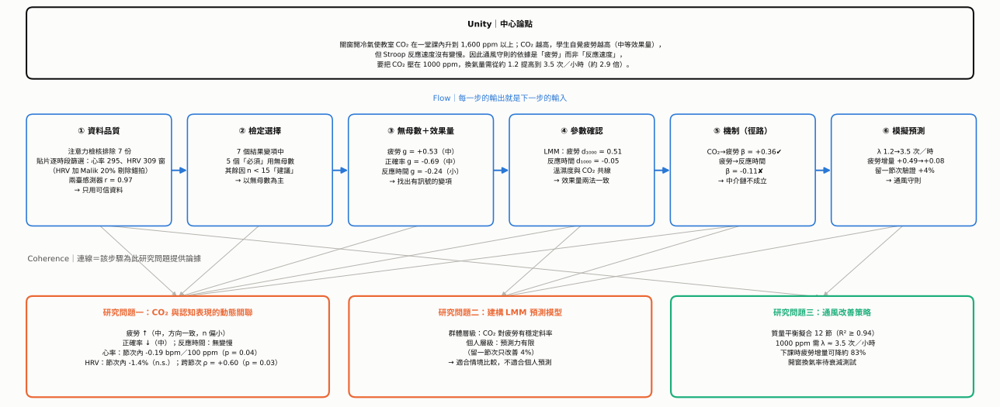
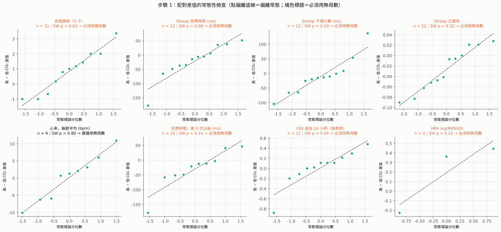
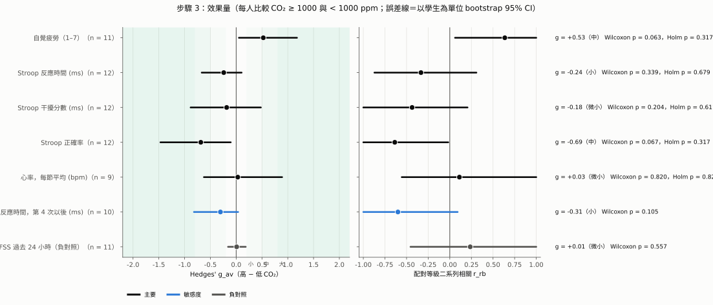
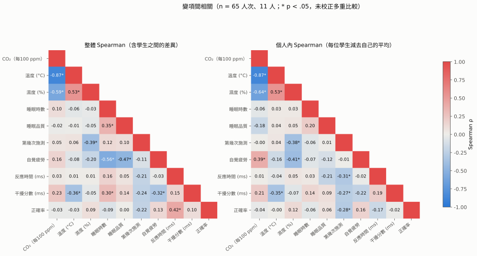
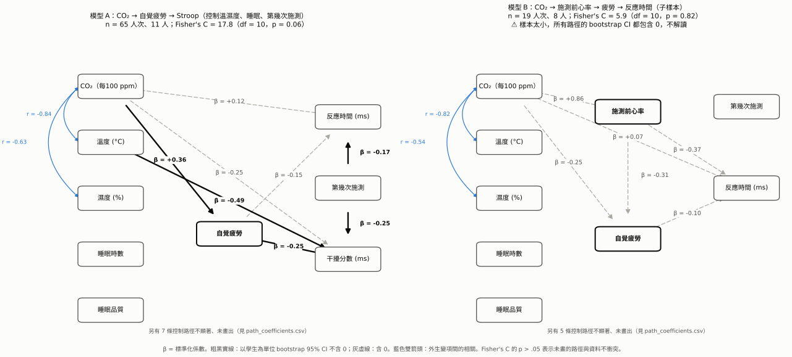
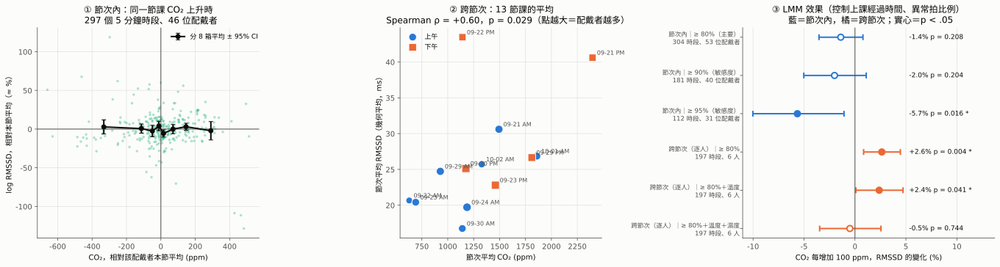
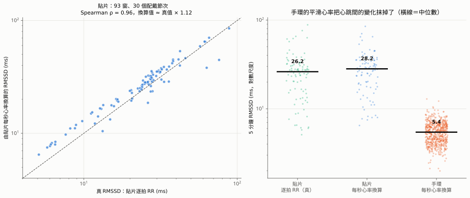
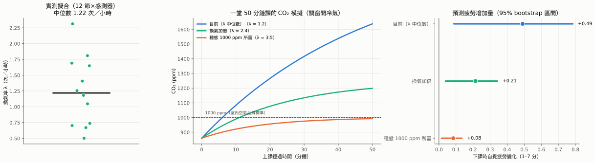

# 高中教室 CO₂ 對學生認知表現影響之預測模型：UCF 整合分析報告

> 資料期間：2026-09-17 ～ 10-02｜12 位學生｜14 個施測場次
> 重現：`python src/run_analysis.py`｜所有圖表為 SVG（`results/figures/svg/`），文字可直接編輯
> 技術細節與完整數值：[REPORT.md](REPORT.md)、[FACTS.md](FACTS.md)

---

## 讀法：本報告如何套用 UCF

| 原則 | 定義 | 在本報告中的做法 |
|---|---|---|
| **Unity（統一）** | 全文只服務一個中心論點 | §1 先寫出中心論點；後面每一節都標明它支持論點的哪一部分 |
| **Coherence（連貫）** | 每段之間有明確的邏輯關係，術語與單位一致 | 每一步都用相同的論證格式：**論點 → 論據 → 推論 → 限制**；效果量一律用 Hedges' g（Cohen's d 的小樣本校正）；CO₂ 一律以兩臺平均、1000 ppm 為界 |
| **Flow（流動）** | 讀者能從前一步自然走到下一步 | §2 的六個步驟依序排列，每一步的「輸出」就是下一步的「輸入」（見路線圖） |

---

## §1 Unity｜中心論點

> **關窗開冷氣使教室 CO₂ 在一堂課內升到 1,600 ppm 以上；CO₂ 越高，學生自覺疲勞越高（中等效果量，g ≈ 0.5），但 Stroop 反應速度沒有變慢。因此，通風守則的科學依據應該是「疲勞」而非「反應速度」；要把 CO₂ 控制在 1000 ppm，換氣量需要從目前約 1.2 次／小時提高到約 3.5 次／小時。**

這個論點與研究目的的對應：

| 研究目的（計畫書） | 研究問題 | 中心論點中回答它的部分 | 主要證據所在 |
|---|---|---|---|
| (一) 探討 CO₂ 與各項認知表現的動態關聯 | 問題一 | 「疲勞 ↑、反應速度不變」 | 步驟 ②③④⑤ |
| (二) 建立線性混合效應預測模型 | 問題二 | 「中等效果量」的模型斜率，可用於情境預測 | 步驟 ④⑥ |
| (三) 提出通風建議守則 | 問題三 | 「換氣量 1.2 → 3.5 次／小時」 | 步驟 ⑥ |

---

## §2 Flow｜分析路線圖

| 步驟 | 輸入 | 做什麼 | 輸出（交給下一步） |
|---|---|---|---|
| ① 資料品質 | 原始資料 | 排除不可信的資料 | 可信的分析資料集 |
| ② 檢定選擇 | 可信資料 | 逐一檢查尺度、常態、離群值、天花板 | 每個變項該用母數或無母數 |
| ③ 無母數＋效果量 | 檢定決策 | Wilcoxon＋Hedges' g＋r_rb | 哪些變項有訊號、訊號多大 |
| ④ 參數確認 | 有訊號的變項 | LMM＋溫濕度調整 | 效果量是否跨方法一致 |
| ⑤ 機制 | 確認後的效果 | 徑路分析 | 疲勞是不是 CO₂ 影響認知的中介 |
| ⑥ 模擬預測 | 確認後的斜率 | 質量平衡＋情境模擬 | 可執行的通風守則 |

---

## §3 Coherence｜逐步論證

### 步驟 ① 資料品質：先確定「拿來分析的資料是真的」

| | 內容 |
|---|---|
| **論點** | 分析前必須先排除不可信的資料，否則後面所有效果量都可能被污染。 |
| **論據** | ① 疲勞量表的注意力檢核題：7 份未通過，全部來自同一位學生，已排除。 ② 心電貼片以 5 分鐘時段篩選：乾淨心跳 ≥ 80% 的時段才使用（633 個時段中 309 個可用於心率、309 個可算出 HRV）。HRV 再以 Malik 準則剔除相鄰 RR 相差 > 20% 的差值，並把異常拍比例放進模型當共變量；≥ 90%、≥ 95% 留作敏感度分析。理由：異常拍每多 1%，心率只偏高約 0.2 bpm，RMSSD 卻高約 3%。異常拍比例與 CO₂ 幾乎無關（ρ = −0.13），殘留雜訊不會偽造出 CO₂ 的效果。 ③ 兩臺 CO₂ 感測器 r = 0.97；但 09-24 起差距方向反轉（Wa1 從較低變成較高 62–216 ppm）。 |
| **推論** | 只用可信資料；CO₂ 一律用兩臺平均（心率／HRV 每節固定一個來源：兩臺都收錄 ≥ 90% 用平均，否則用完整的那一臺）。後面的等級檢定不受固定偏差影響，因此感測器的差距不會改變無母數結論。 |
| **限制** | 感測器差距反轉的原因未查明；手環無品質欄位，只能用數值合理性判斷。 |

**→ 交給步驟 ②**：82 筆 Stroop 人次、69 份疲勞問卷、62 筆逐人心率節次、309 個 HRV 時段。

---

### 步驟 ② 檢定選擇：每一組資料該用母數還是無母數？

| | 內容 |
|---|---|
| **論點** | 12 人的重複測量資料，大多數結果變項都應以無母數檢定為主要證據。 |
| **論據** | 見下方判斷規則、決策表與 Q-Q 圖。 |
| **推論** | 7 個結果變項中，5 個「必須」用無母數；心率與 HRV「建議」用無母數。以 Wilcoxon 符號等級檢定作為主要檢定，配對 t 檢定只列出來對照。 |
| **限制** | n < 15 時，常態檢定本身的檢定力不足。「SW p > .05」不能證明是常態，只能說沒有被否定。 |

**判斷規則（事先定好，公開透明）：**

1. 任一項成立 → **必須用無母數**：
   - 順序尺度；
   - 天花板效應 > 30%；
   - 配對差值的 Shapiro–Wilk p < .10；
   - 有離群值（距中位數超過 3 倍 MAD）；
   - |偏態| > 1。
2. 以上都沒有，但配對人數 < 15 → **建議用無母數**。

**決策表**（`results/assumption_checks.csv`）：

| 結果變項 | 尺度 | 配對 n | 差值 SW p | 偏態 | 離群值 | 天花板 | 決策 | 主要理由 |
|---|---|---|---|---|---|---|---|---|
| 自覺疲勞（1–7） | 順序 | 11 | 0.62 | +0.15 | 0 | 9% | **必須** | 順序尺度 |
| Stroop 反應時間 | 比率 | 12 | 0.08 | −1.48 | 1 | 0% | **必須** | 非常態、偏態、離群值 |
| Stroop 干擾分數 | 差異分數 | 12 | 0.19 | +1.07 | 2 | 0% | **必須** | 偏態、2 個離群值 |
| Stroop 正確率 | 比例 | 12 | 0.32 | −0.15 | 0 | **38%** | **必須** | 天花板效應 |
| 心率（每節平均） | 比率 | 11 | 0.37 | +0.09 | 0 | 0% | 建議 | n = 11 |
| HRV log(RMSSD)（每節平均） | 連續（對數） | 5 | 0.66 | −0.63 | 0 | 0% | 建議 | n = 5 |
| FSS（負對照） | 順序 | 11 | 0.045 | −1.68 | 1 | 10% | **必須** | 順序、非常態 |

HRV 只有 5 人，因為大多數場次的貼片無法對應到學生（09-21 ～ 09-23 施測時沒有記錄字母代號對應的貼片編號）。

**環境變項**（節次層級，n = 9）：CO₂、溫度、濕度的 Shapiro p 分別為 0.86、0.08、0.68，但只有 9 個點，而且 CO₂ 呈「上午低、下午高」的兩群分布。所以變項之間的相關一律用 **Spearman 等級相關**（`results/environment_distribution.csv`）。

**→ 交給步驟 ③**：以 Wilcoxon 為主檢定、以 Hedges' g 為效果量。

---

### 步驟 ③ 無母數檢定＋效果量：哪些變項有訊號？訊號多大？

| | 內容 |
|---|---|
| **論點** | CO₂ 升高時，**自覺疲勞上升（中等效果）、正確率下降（中等效果）**，反應時間沒有變慢。 |
| **論據** | 見下表與森林圖。 |
| **推論** | 只看 p 值會得到「全部不顯著」（6 個主要變項 Holm 校正後最小 p = 0.38）；但效果量顯示疲勞與正確率是中等效果，而且 bootstrap 區間不含 0。在 n ≈ 11 時，「不顯著」主要反映的是檢定力不足，而不是沒有效應：若 d_z = 0.61，n = 11 的檢定力只有 45%，要 80% 檢定力需要約 24 人。 |
| **限制** | 疲勞與正確率的 Wilcoxon p 都只是邊緣（0.063、0.067）；Holm 校正後都不顯著；高、低 CO₂ 的比較沒有控制溫濕度（留給步驟 ④）。 |

**比較方式**：每位學生在 CO₂ ≥ 1000 ppm（環境部室內空氣品質標準）與 < 1000 ppm 的節次各取一個平均，形成配對資料（`results/effect_sizes.csv`）。

| 結果變項 | n | 上升／下降人數 | HL 中位差 | Wilcoxon p | Holm p | **Hedges' g_av**（95% CI） | 大小 | r_rb（95% CI） |
|---|---|---|---|---|---|---|---|---|
| **自覺疲勞** | 11 | 8／3 | **+0.85 分** | 0.063 | 0.38 | **+0.53**（0.05, 1.18） | **中** | +0.64（0.06, 1.00） |
| **Stroop 正確率** | 12 | 3／8 | **−2.7%** | 0.067 | 0.38 | **−0.69**（−1.47, −0.11） | **中** | −0.64（−1.00, −0.02） |
| Stroop 反應時間 | 12 | 4／8 | −14.5 ms | 0.34 | 0.64 | −0.24（−0.67, 0.11） | 小 | −0.33（−0.87, 0.31） |
| Stroop 干擾分數 | 12 | 3／9 | −13.9 ms | 0.20 | 0.61 | −0.18（−0.88, 0.48） | 微小 | −0.44（−1.00, 0.21） |
| 心率（每節平均） | 11 | 5／6 | −2.8 bpm | 0.32 | 0.64 | −0.33（−0.95, 0.36） | 小 | −0.36（−0.85, 0.33） |
| HRV log(RMSSD)（每節平均） | 5 | 4／1 | +0.14 | 0.13 | 0.50 | +0.26（0.06, 4.20） | 小 | +0.87（0.20, 1.00） |
| **FSS（負對照）** | 11 | 7／3 | +0.06 | 0.56 | — | **+0.01**（−0.16, 0.18） | 微小 | +0.24（−0.45, 1.00） |

**逐項論證：**

1. **疲勞（核心證據）**：11 人中 8 人在高 CO₂ 時比較累，中位差 +0.85 分（7 分量表），g = 0.53 屬中等效果。
2. **負對照通過**：FSS 問的是「過去 24 小時」，理論上不該跟當下 CO₂ 有關。結果 g = 0.01，CI 很窄而且緊貼 0。這排除了「學生在高 CO₂ 節次就是習慣填比較高分」的解釋，讓第 1 點更可信。
3. **正確率（新出現的訊號）**：12 人中 8 人在高 CO₂ 時正確率較低，g = −0.69。這與計畫書引用的 Gong et al. (2026)「CO₂ 使正確率下降」方向一致。
4. **反應時間（無變慢）**：方向甚至略偏「變快」（g = −0.24）。若同時看第 3 點，高 CO₂ 時「稍快但較不準」，有可能是**速度—正確率的取捨**（較衝動地作答），但目前證據不足以下定論。
5. **心率、HRV**：心率 g = −0.33（小，CI 含 0）。HRV g = +0.26，5 人中 4 人在高 CO₂ 時 HRV 較高，但人數太少，CI 很寬。

**→ 交給步驟 ④**：疲勞與正確率有訊號，需要用 LMM 並控制溫濕度來確認。

---

### 步驟 ④ 參數模型確認：效果量能不能跨方法重現？

| | 內容 |
|---|---|
| **論點** | 疲勞的效果量在兩種方法中一致；正確率的效果在 LMM 中減弱。 |
| **論據** | 見下表。 |
| **推論** | **疲勞**：無母數 g 與 LMM 的 d₁₀₀₀ 幾乎相同（0.53 vs 0.51），而且 LMM 的 CI 不含 0 → 效果穩健（LMM：0.063 分／100 ppm，p = 0.009，ΔAIC −4.3）。**正確率**：LMM 中從 −0.69 降到 −0.23，CI 含 0（LMM p = 0.21）→ 只能列為待確認。**反應時間**：LMM −0.30 ms／100 ppm（p = 0.79）；d₁₀₀₀ 的 CI（−0.42 ～ 0.32）排除了中等以上的效果（\|d\| ≥ 0.5），所以「沒有變慢」是有根據的結論，不只是不顯著。 |
| **限制** | 疲勞 LMM 加入溫度與濕度後，係數變為 0.078（p = 0.06）；只用溫濕度、不放 CO₂ 的模型，AIC 與只用 CO₂ 的模型只差 0.8，兩者無法區分。CO₂、溫度、濕度在本研究中是同一個「關窗開冷氣」狀態的三個面向（CO₂ 與溫度 ρ = −0.87），無法分開。 |

LMM 版的效果量 d₁₀₀₀ = 每升高 1000 ppm 的係數 ÷ 個人內殘差標準差：

| 結果變項 | 無母數 g_av（高 vs 低） | LMM d₁₀₀₀（95% CI） | 控制了什麼 | 兩法一致？ |
|---|---|---|---|---|
| 自覺疲勞 | +0.53 | **+0.51**（0.13, 0.90） | 控制變項 | ✔ 一致 |
| 正確率 | −0.69 | −0.23（−0.60, 0.13） | — | △ 方向一致、強度減弱 |
| 反應時間 | −0.24 | −0.05（−0.42, 0.32） | — | ✔ 都接近 0 |
| 干擾分數 | −0.18 | +0.28（−0.08, 0.65） | — | ✘ 方向相反 → 不採信 |
| 心率（每節平均） | −0.33 | +0.10（−0.56, 0.75） | — | ✘ 不穩定（節次內分析見 ⑤-2） |
| HRV（每節平均） | +0.26 | +1.06（0.05, 2.08） | — | △ 方向一致，只有 5 人 |

**→ 交給步驟 ⑤**：唯一跨方法穩健的是 CO₂ → 疲勞。接下來要問：疲勞有沒有把 CO₂ 的影響傳到認知表現？

---

### 步驟 ⑤ 機制：疲勞是不是 CO₂ 影響認知的中介？

| | 內容 |
|---|---|
| **論點** | CO₂ → 疲勞成立；疲勞 → 反應時間不成立，所以中介鏈不成立。 |
| **論據** | Piecewise SEM（每條方程都是學生隨機截距 LMM；以學生為單位 bootstrap 2,000 次）。 **模型 A**（n = 65 人次、11 人）： • CO₂ → 疲勞 β = **+0.36**，CI 0.008 ～ 0.166（原單位，分／100 ppm）✔，已控制溫度、濕度與控制變項 • 疲勞 → 反應時間 β = −0.11，CI −45 ～ 14 ms ✘ • 間接效果 CO₂ → 疲勞 → 反應時間 = −0.64 ms，CI −5.9 ～ 1.4 ✘ • 模型適配 Fisher's C = 12.7，df = 8，p = 0.12（可接受） |
| **推論** | 對應步驟 ③④：疲勞上升是真的，但它沒有轉化成反應變慢。這與 Snow et al. (2018)「主觀與客觀指標不同步」的觀察相呼應，只是方向相反：本研究是主觀先動、客觀（反應時間）沒動。 |
| **限制** | 疲勞 → 干擾分數（β = −0.20）與溫度 → 干擾分數（β = −0.56）雖然顯著，但方向與理論相反（越累，干擾越小），而且干擾分數信度低（各情境只有 8 題），因此**不採信**。加入施測前心率的模型 B 只有 19 人次、8 人，所有路徑的 bootstrap CI 都包含 0，**不解讀**。HRV 能對應到學生的只有 15 人次（5 人），沒有放進徑路模型。 |

#### ⑤-1 完整徑路係數（`results/path_coefficients.csv`、`path_indirect_effects.csv`、`path_model_fit.csv`）

**模型 A**（n = 65 人次、11 人；Fisher's C = 12.7，df = 8，p = 0.12；疲勞方程已控制控制變項）。✔ 表示以學生為單位的 bootstrap 95% CI 不含 0。

| 結果 ← 預測變項 | b（原單位） | 標準化 β | LMM p | bootstrap 95% CI | |
|---|---|---|---|---|---|
| 疲勞 ← CO₂（每 100 ppm） | +0.100 | +0.36 | 0.044 | 0.008 ～ 0.166 | ✔ |
| 疲勞 ← 溫度 (°C) | +0.801 | +0.25 | 0.108 | −0.207 ～ 1.734 | |
| 疲勞 ← 濕度 (%) | −0.066 | −0.16 | 0.131 | −0.157 ～ 0.001 | |
| 反應時間 ← 疲勞 | −6.38 ms | −0.11 | 0.361 | −45.2 ～ 14.1 | |
| 反應時間 ← CO₂ | +2.17 ms | +0.14 | 0.435 | −3.3 ～ 8.8 | |
| 反應時間 ← 溫度 | +19.0 ms | +0.10 | 0.495 | −42.2 ～ 106.3 | |
| 反應時間 ← 濕度 | +1.46 ms | +0.06 | 0.551 | −1.5 ～ 4.3 | |
| 干擾分數 ← 疲勞 | −8.85 ms | −0.20 | 0.112 | −24.0 ～ −1.9 | ✔ |
| 干擾分數 ← CO₂ | −2.92 ms | −0.23 | 0.320 | −9.1 ～ 2.7 | |
| 干擾分數 ← 溫度 | −82.5 ms | −0.56 | 0.007 | −166.1 ～ −8.2 | ✔ |
| 干擾分數 ← 濕度 | −0.32 ms | −0.02 | 0.906 | −6.3 ～ 5.0 | |

| 間接效果 | 估計值 | bootstrap 95% CI | bootstrap p |
|---|---|---|---|
| CO₂ → 疲勞 → 反應時間 | −0.64 ms | −5.89 ～ 1.40 | 0.80 |
| CO₂ → 疲勞 → 干擾分數 | −0.88 ms | −2.87 ～ −0.02 | 0.041（方向與理論相反，不採信） |
| 溫度 → 疲勞 → 反應時間 | −5.11 ms | −62.2 ～ 13.0 | 0.78 |
| 濕度 → 疲勞 → 反應時間 | +0.42 ms | −1.59 ～ 3.26 | 0.80 |

**模型 B**（加入施測前 10 分鐘心率；n = 19 人次、8 人）：所有路徑的 bootstrap CI 都包含 0，樣本過小，**全部不解讀**。

#### ⑤-2 生理指標：心率與 HRV（主要變項；`results/hr_hrv_main.csv`）

| | 內容 |
|---|---|
| **論點** | 同一節課內，CO₂ 上升時心率略降、HRV 沒有改變；CO₂ 較高的節次 HRV 較高，但無法與較涼、較乾的冷氣環境分開。 |
| **論據** | ① **方法**：5 分鐘窗，乾淨心跳 ≥ 80%；HRV（RMSSD，取對數）只用貼片逐拍 RR，經 Malik 20% 篩選，並以異常拍比例為共變量；所有模型控制上課經過時間；每節固定一個 CO₂ 來源。 ② **心率**（節次內，配戴者 = 裝置 × 節次）：CO₂ 每 100 ppm −0.19 bpm（95% CI −0.38 ～ −0.01，p = 0.041；898 窗、119 位配戴者）。只用兩臺都有資料的窗 −0.21（p = 0.063）；加入溫度、濕度後 −0.17（p = 0.19）。 ③ **HRV**：見下表。 ④ **手環不能換算 HRV**（`results/hrv_conversion_check.csv`）：貼片每秒心率換算的 RMSSD 與逐拍真值高度相關（175 窗，ρ = 0.86，約為真值 × 1.25）；手環換算值中位數只有 **5.4 ms**，貼片真值為 **25.7 ms**，低估約 80%。207,690 個手環封包中，含 RR 間隔的是 **0 個**。（手環與貼片不是同一人同時配戴，這是兩組分布的比較。） |
| **推論** | 心率的效果很小（1000 ppm 約 2 bpm），加入溫濕度後不顯著。HRV 在節次內沒有變化；跨節次的正向結果控制溫度後仍成立，但加入濕度後消失。兩者都和疲勞一樣，無法與「開冷氣、關窗」的整體狀態分開。 |
| **限制** | 跨節次逐人分析只有 6 人：09-21 ～ 09-23 施測時沒有記錄貼片字母代號對應的編號，這段期間無法連到個人。HRV 能同時對應到 Stroop 與疲勞的只有 15 人次（5 人），所以沒有放進徑路模型。 |

| HRV 分析 | 樣本 | CO₂ 每 100 ppm 的 RMSSD 變化 | p |
|---|---|---|---|
| 節次內，≥ 80%（主要） | 304 窗、53 位配戴者 | −1.4%（CI −3.5% ～ +0.8%） | 0.21 |
| 節次內，≥ 90%（敏感度） | 181 窗、40 位 | −2.0% | 0.20 |
| 節次內，≥ 95%（敏感度） | 112 窗、31 位 | −5.7%（CI −10.0% ～ −1.1%） | 0.016 |
| 跨節次，逐人 LMM | 197 窗、6 人 | +2.6%（CI +0.8% ～ +4.5%） | 0.004 |
| 跨節次，逐人＋溫度 | 同上 | +2.4% | 0.041 |
| 跨節次，逐人＋溫度＋濕度 | 同上 | −0.5% | 0.74 |
| 節次平均 | 13 節 | Spearman ρ = +0.60 | 0.029 |

**→ 交給步驟 ⑥**：可以拿來做預測的是「CO₂ → 疲勞」這條穩定的斜率（0.063 分／100 ppm）。

---

### 步驟 ⑥ 模擬預測：把斜率轉成可執行的通風守則

| | 內容 |
|---|---|
| **論點** | 目前關窗開冷氣時的換氣量約 1.2 次／小時，需要提高到約 3.5 次／小時，才能把 CO₂ 控制在 1000 ppm，並讓下課時的疲勞增量減少約 83%。 |
| **論據** | ① **質量平衡擬合**（Persily & de Jonge, 2017）：12 段 CO₂ 上升曲線，R² ≥ 0.94，換氣率中位數 1.22 次／小時。 ② **穩態推算**：1000 ppm 所需換氣率 = 2,021 ÷ (1000 − 420) ≈ 3.5 次／小時。 ③ **情境模擬**：一堂 50 分鐘課，下課時疲勞增量從目前的 +0.49 分（95% 區間 0.09–0.78），降到 3.5 次／小時時的 +0.08 分（0.01–0.13）。 ④ **驗證**：留一節次交叉驗證，加入 CO₂ 後 RMSE 改善 4.0%。 |
| **推論** | 模型適合用來比較**群體層級**的通風情境，不適合預測**個別學生**的分數（Riesterer et al., 2020）。 |
| **限制** | 情境結果代表「關窗開冷氣」整體狀態的效果，不是單獨降低 CO₂ 的效果（步驟 ④ 的共線性）；開窗時的換氣率還沒有實測。 |

| 情境 | 換氣率（次／小時） | 下課時 CO₂ | 超過 1000 ppm 的分鐘數 | 下課時疲勞增量（95% 區間） |
|---|---|---|---|---|
| 目前 | 1.22 | 1,637 ppm | 44 | +0.49（0.09, 0.78） |
| 換氣加倍 | 2.43 | 1,199 ppm | 39 | +0.21（0.04, 0.34） |
| 1000 ppm 目標 | 3.48 | 992 ppm | 0 | +0.08（0.01, 0.13） |

---

## §4 回扣研究問題

| 研究問題 | 回答 | 證據強度 | 依據 |
|---|---|---|---|
| **問題一**：CO₂ 與反應時間、生理訊號、自覺疲勞的動態關聯 | **疲勞**：CO₂ 越高越累，中等效果（g = 0.53，d₁₀₀₀ = 0.51） **正確率**：可能下降，中等效果（g = −0.69），LMM 中減弱 **反應時間**：沒有變慢，排除了中等以上的效果 **心率**：同一節課內略降（−0.19 bpm／100 ppm，p = 0.04），幅度很小 **HRV**：同一節課內沒有變化；CO₂ 較高的節次 HRV 較高（ρ = +0.60），但與冷氣造成的較涼、較乾環境分不開 | 疲勞 ★★☆ 反應時間 ★★★（「無效應」） 正確率 ★☆☆ 心率 ★☆☆ HRV ★☆☆ | ③④⑤ |
| **問題二**：如何建構有效預測認知表現的 LMM | 以學生為隨機截距、已控制控制變項的疲勞 LMM，斜率 0.063 分／100 ppm（bootstrap CI 0.011–0.100）。適合群體情境預測；個人預測力有限（留一節次改善 4%） | ★★☆ | ④⑥ |
| **問題三**：具體可行的環境改善策略 | 開冷氣時換氣量需達約 3.5 次／小時（目前約 1.2）；或改用定時開窗，但開窗時的換氣率需要先實測 | ★★☆ | ⑥ |

---

## §5 反駁與限制（逐一回應可能的質疑）

| 可能的質疑 | 回應 | 仍存在的風險 |
|---|---|---|
| 「疲勞上升是因為下午比較累，不是 CO₂」 | 09-24 之後有多節「上午開冷氣」，CO₂ 與上午／下午的相關從 0.93 降到 0.76；加入上午／下午後，係數 0.066 幾乎不變 | p 從 0.009 變成 0.10，證據變弱 |
| 「是溫濕度，不是 CO₂」 | 徑路模型控制溫濕度後，CO₂ → 疲勞仍成立 | 只用溫濕度的模型 AIC 與只用 CO₂ 相近 → 無法排除 |
| 「HRV 在高 CO₂ 節次較高，是 CO₂ 造成的」 | 節次內 CO₂ 上升時 HRV 沒有變化；跨節次的正向結果加入濕度後消失 | 只有 6 人能做逐人分析 |
| 「學生只是習慣在某些節次填高分」 | FSS 負對照 g = 0.01 | 單題自評仍可能受情境影響 |
| 「多重比較，碰巧顯著」 | 已用 Holm 校正並如實報告（全部 > 0.05）；改以效果量與跨方法一致性作為主要依據 | 正確率的訊號可能是偶然 |
| 「12 人太少」 | 用無母數＋學生層級 bootstrap，不依賴分配假設；並計算檢定力 | 疲勞的檢定力約 45%；要 80% 需約 24 人 |
| 「CO₂ 量錯了」 | 兩臺 r = 0.97；等級檢定不受固定偏差影響 | 09-24 起差距反轉，原因未查 |

**倫理備註**：共 4 節在 2000 ppm 以上施測，與計畫書的中止條件不符，需與指導老師討論是否通報 REC。

---

## §6 下一步（依對中心論點的貢獻排序）

1. **擴大疲勞的證據**：目標 ≥ 24 人（正確率約 21 人），或增加更多「上午 CO₂ 高、下午 CO₂ 低」的節次，讓疲勞效果的檢定力達到 80%。
2. **確認正確率的訊號**：考慮把 Stroop 正式題增加到每種情境 16 題以上，降低天花板效應並提高干擾分數的信度。這需要提出計畫變更。
3. **開窗衰減測試**：開窗後記錄 10 分鐘的 CO₂ 下降，估出開窗時的換氣率，才能把「定時開窗」寫進守則。
4. **感測器並排校正**：查明 09-24 的差距反轉。
5. **心率與 HRV 資料**：之後每節課都記下「學生 → 裝置編號」（不用字母代號），讓所有生理資料都能連到個人（HRV 要達 80% 檢定力約需 11 人，目前 5 人）；只保留穩定的貼片（E2603-10、E2605-04），並固定由同一位學生配戴同一個裝置。

---

## 附錄 A｜效果量與檢定的定義

| 指標 | 公式／做法 | 解讀 |
|---|---|---|
| Cohen's d_z | 差值平均 ÷ 差值標準差 | 配對設計的標準化差異 |
| Cohen's d_av | 差值平均 ÷ 兩條件標準差的平均（Lakens, 2013） | 較接近一般的「組間」d，比 d_z 保守 |
| Hedges' g | d × J，J = 1 − 3 ÷ (4·df − 1)，df = n − 1（Hedges, 1981） | 小樣本校正；本報告的主要效果量 |
| 大小判準 | \|g\| < 0.2 微小、0.2–0.5 小、0.5–0.8 中、≥ 0.8 大（Cohen, 1988） | |
| r_rb | 配對等級二系列相關（Kerby, 2014） | 無母數效果量，−1 ～ +1 |
| d₁₀₀₀ | LMM 斜率 × 10 ÷ 個人內殘差標準差 | 連續暴露版的 d：每升高 1000 ppm 的標準化差異 |
| HL 中位差 | 所有 Walsh 平均的中位數 | 無母數的「典型差異」 |
| 95% CI | 以學生為單位 bootstrap 5,000 次（百分位法） | 不假設常態 |
| Holm 校正 | 主要家族（6 個結果變項：疲勞、反應時間、干擾分數、正確率、心率、HRV）依 p 由小到大，依序乘上 6、5、4、3、2、1（Holm, 1979） | 控制族系錯誤率 |

## 附錄 B｜參考文獻（方法）

- Cohen, J. (1988). *Statistical power analysis for the behavioral sciences* (2nd ed.). Lawrence Erlbaum.
- Field, C. A., & Welsh, A. H. (2007). Bootstrapping clustered data. *Journal of the Royal Statistical Society: Series B, 69*(3), 369–390.
- Hedges, L. V. (1981). Distribution theory for Glass's estimator of effect size and related estimators. *Journal of Educational Statistics, 6*(2), 107–128.
- Holm, S. (1979). A simple sequentially rejective multiple test procedure. *Scandinavian Journal of Statistics, 6*(2), 65–70.
- Kerby, D. S. (2014). The simple difference formula: An approach to teaching nonparametric correlation. *Comprehensive Psychology, 3*, 11.IT.3.1.
- Lakens, D. (2013). Calculating and reporting effect sizes to facilitate cumulative science: A practical primer for t-tests and ANOVAs. *Frontiers in Psychology, 4*, 863.
- Lefcheck, J. S. (2016). piecewiseSEM: Piecewise structural equation modelling in R for ecology, evolution, and systematics. *Methods in Ecology and Evolution, 7*(5), 573–579.
- Shipley, B. (2009). Confirmatory path analysis in a generalized multilevel context. *Ecology, 90*(2), 363–368.
- 其餘（Persily & de Jonge, 2017；Gong et al., 2026；Snow et al., 2018；Riesterer et al., 2020；Jensen, 1965）見研究計畫書。
